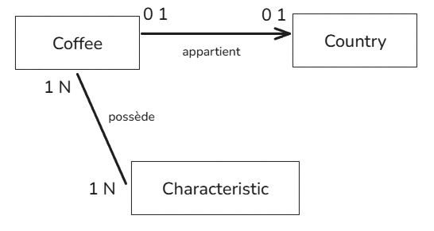

# Cahier des charges

## Analyse de la demande

"Pour simplifier l'intégration de données par notre équipe, nous souhaitons une séparation en 3 entités avec des relations dans la base de données :

- Cafés
- Pays
- Caractéristiques"

=> On doit mettre en place une bdd avec ces 3 entités et faire en sorte qu'elles soient reliées entre elles.

### MCD (Modèle Conceptuel des Données)



Chaque café appartient à un seul pays, et chaque café peut avoir plusieurs caractéristiques.

### MLD (Modèle Logique de Données)


### MPD (Modèle Physique de Données)

```SQL
CREATE TABLE "coffee" (
    "coffee_id" INT PRIMARY KEY,
    "name" TEXT ,
    "description" TEXT,
    "price" INT,
    "country_id" INT,
    "in_stock" BOOLEAN,
    "characteristic_id" INT,
    FOREIGN KEY ("country_id") REFERENCES "country"("country_id")
    FOREIGN KEY ("characteristic_id") REFERENCES "characteristic"("characteristic_id")
);

CREATE TABLE "country" (
    "country_id" INT GENERATED ALWAYS AS IDENTITY PRIMARY KEY,
    "name" TEXT
);

CREATE TABLE "characteristic" (
    "characteristic_id" INT GENERATED ALWAYS AS IDENTITY PRIMARY KEY,
    "name" TEXT
);
```